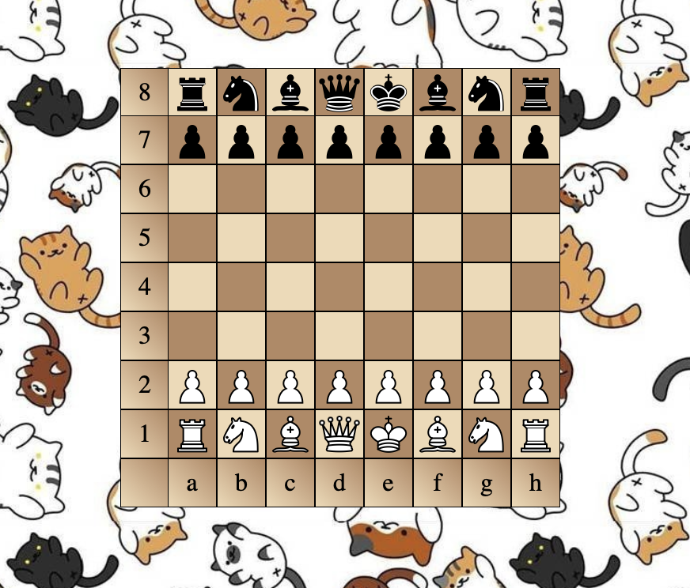

# Выполнила: Гудошникова Юлия Владимировна
## Группа: БПИ217
# Домашнее задание №1: Шахматная доска

Домашнее задание проводится в рамках курса НИС "Кроссплатформенные и облачные веб-приложения" по теме: **"Введение в веб-разработку. HTML, CSS"**

## Формулировка

В рамках данного задания вам необходимо создать верстку стандартной шахматной доски с шахматными фигурами на стартовых позициях, используя только HTML и CSS как инструмент.
Параметры фрагментов доски и фигур:

- Размер шахматной клетки: 30х30 пикселей

### Обязательные требования к работе

Итоговая работа включает в себя:

- Файл index.html, содержащий верстку страницы
- Файл style.css, содержащий стили к HTML-странице

Фигуры располагаются на своих клетках в начале партии точно по центру в своей клетке

### Дополнительное задание

- На итоговой работе присутствует система координат, где по оси абсцисс отображены буквы латинского алфавита, а по оси ординат - цифры. Начало координат ведется от белой левой ладьи;
- Шахматные клетки имеют отличные от черного и белого цвета;
- Фигуры используются в верстке как изображения, а не символы; изображения с фигурами можно как скачать и сохранить в папке с работой, так и сослаться в HTML-файле на сторонний ресурс (на ваше усмотрение);
- Задан заголовок вкладки, отличный от `Document` или другого стандартного названия

# Результат проделанной работы:



## Соблюдена следующая организация файлов в работе:

```fs
├── chessboard
│   ├── assets
│   │   ├── chess_figure
│   │   │   ├── <шахматные_фигуры>.svg
│   │   ├── background_cat.jpg // фон страницы
│   │   ├── preview.png // демонстрация итоговой работы
│   ├── css
│   │   ├── chessboard.css // стили для шахматной доски
│   │   ├── global.css // стили для страницы в целом
│   ├── index.html // разметка
```
## Выполненные критерии:
Работа выполнена с учетом всех критериев, как основных, так и дополнительных.

**Кроме того были добавлены:**
1. Фон html страницы
2. Использовался градиент для клеток разметки
3. При наведении курсора на клетку меняется цвет клетки, а также клетка увеличивается в размере. Все это происходит с анимацией.
4. Использовался шрифт Georgia для разметки.

